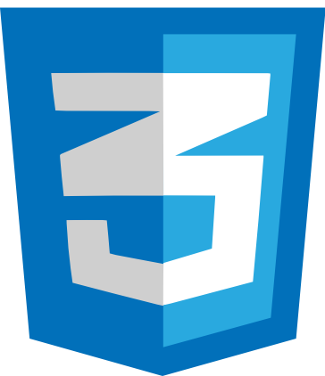

<!--Cover -->

  
  
    
  <!--Social Media -->
  

    <a href="https://www.instagram.com/berkay.crk/" target="_blank"><a/>
    <a href="https://twitter.com/berkaycirak" target="_blank"><a/>
    <a href="https://www.linkedin.com/in/berkaycrk/" target="_blank"><a/>
  
 
  
  <h2>About Me</h2>
   
  
<strong>Hello everyone, I'm Berkay- 24 y/o Turkish coder.   
    📚 Currently learning Web3, Blockchain and Frontend Technologies</li>  
    ⚡ Always ready to collaborate for modern projects and communities   
    🎯 Motivated to be a good Frontend and Web3 Developer   
  

<!--Arrow Gif-->

<!--Technologies -->
  <h2 align="center">Languages & Tools</h2>
   
  

    
    
    
    
    
    
    
    
    
    
    
    

  

  

  
<!--Arrow Gif-->

<!--Stats-->

<!--Blogs-->

<h2 align="center">My Blogs</h2>

<!-- BLOG-POST-LIST:START -->
- [How I Have Landed a Software Job in 4 Months as a Frontend Developer?](https://medium.com/@berkaycrk/how-i-have-landed-a-software-job-in-4-months-as-a-frontend-developer-3b027419f51c?source=rss-1ca17d37dc3f------2)
- [Is “Angela Yu: Web Development Bootcamp 2022” worth for beginners ?](https://medium.com/@berkaycrk/is-angela-yu-web-development-bootcamp-2022-worth-for-beginners-a84a73cd15ea?source=rss-1ca17d37dc3f------2)
- [Z-index in Grid Layout](https://medium.com/@berkaycrk/z-index-in-grid-layout-f6edf9648ea2?source=rss-1ca17d37dc3f------2)
<!-- BLOG-POST-LIST:END -->

<!--Visitor Counter-->

  

